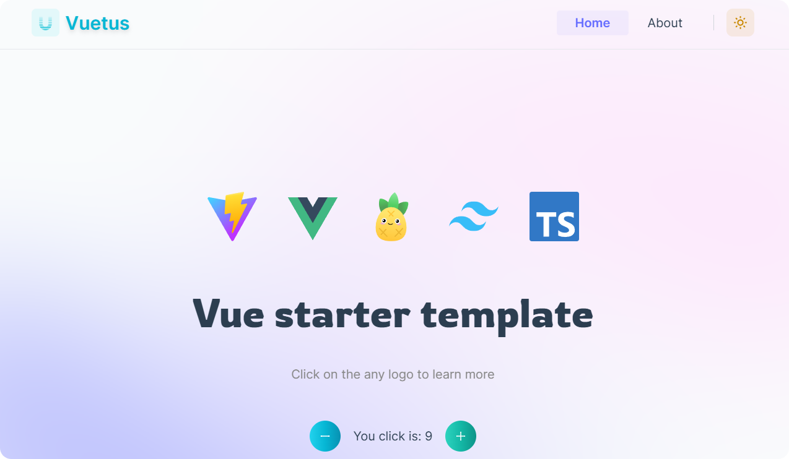

<p align='center'>
    Mocking up web app with <b><a href="https://github.com/thuongtruong109/vue-template/generate">Vuetus</a></b>
</p>

<br>

<p align='center'>
    <a href="https://vuetus.vercel.app/">🪟 Live Demo</a>
</p>

<br>

> **Note**: If you are seeking for better Vue developer experience and more consistent maintenance, we recommend using [Nuxt 3](https://nuxt.com) instead (it also works perfectly with SPA or SSG as needed). This template still serves as a reference, but expect slower updates.

<br>

<div align='center'>
    <a align="center" href="https://pagespeed.web.dev/analysis/https-vuetus-vercel-app/ukjcyufeqf?form_factor=desktop">
        
    </a>
</div>

## ✨ Features

⚡️ [Vue 3](https://github.com/vuejs/core), [Vite](https://github.com/vitejs/vite)

📦 [Components auto importing](./src/components)

🍍 [State Management via Pinia](https://pinia.vuejs.org/)

📑 [Layout system](./src/layouts)

🎨 [Tailwind](https://tailwindcss.com) - the instant on-demand atomic CSS engine

😃 [Vue Icons Plus](https://vue-icons.com/icons/) - simple icons package for Vue

🔥 Use the [new `<script setup>` syntax](https://github.com/vuejs/rfcs/pull/227)

📥 [APIs auto importing](https://github.com/antfu/unplugin-auto-import) - use Composition API and others directly

🦔 [Stylelint](https://stylelint.io/) and [ESLint](https://eslint.org/) with [Prettier](https://prettier.io/) - Keep your code clean

🦾 TypeScript, of course

☁️ Deploy on [Netlify](https://netlify.com), zero-config

📲 [PWA](https://github.com/antfu/vite-plugin-pwa) - offline working mode

🌊 [AOS](https://www.npmjs.com/package/aos) - animation package

🗂 [File based routing](./src/pages) with [unplugin-vue-router](https://github.com/posva/unplugin-vue-router)

<!-- - ⚙️ Unit Testing with [Vitest](https://github.com/vitest-dev/vitest), E2E Testing with [Cypress](https://cypress.io/) on [GitHub Actions](https://github.com/features/actions) -->

<br>

## 🪶 Dev tools

- [Npm](https://npmjs.com/) - efficient package manager
- [Netlify](https://www.netlify.com/) - zero-config deployment
- [Stackblitz](https://stackblitz.com/github/thuongtruong109/vuetus) - online IDE for editing and previewing web apps
- [VS Code Extensions](./.vscode/extensions.json) - recommended extensions for VS Code
- [Vetur](https://marketplace.visualstudio.com/items?itemName=octref.vetur) - Vue tooling
- [Vite](https://marketplace.visualstudio.com/items?itemName=antfu.vite) - Fire up Vite server automatically
- [Volar](https://marketplace.visualstudio.com/items?itemName=Vue.volar) - Vue 3 `<script setup>` IDE support
- [ESLint](https://marketplace.visualstudio.com/items?itemName=dbaeumer.vscode-eslint)
- [Stylelint](https://marketplace.visualstudio.com/items?itemName=stylelint.vscode-stylelint)
- [Prettier](https://marketplace.visualstudio.com/items?itemName=esbenp.prettier-vscode) - Code formatter

## 💡 Why

I have created several Vite apps recently. Setting the configs up is kinda the bottleneck for me to make the ideas simply come true within a very short time.

So I made this starter template for myself to create apps more easily, along with some good practices that I have learned from making those apps. It's strongly opinionated, but feel free to tweak it or even maintain your own forks.

## 🕯️ Variations

As this template is strongly opinionated, the following provides a curated list for community-maintained variations with different preferences and feature sets. Check them out as well. PR to add yours is also welcome!

### 🍃 GitHub Template

[Create a repo from this template on GitHub](https://github.com/thuongtruong109/vue-template/generate).

### 🎫 Clone to local

If you prefer to do it manually with the cleaner git history

```bash
npx degit thuongtruong109/vuetus my-vue-app
cd my-vue-app
npm i
```

## 📃 Checklist

When you use this template, try follow the checklist to update your info properly

- [ ] Change the author name in `LICENSE`
- [ ] Change the title in `index.html`
- [ ] Change the hostname in `vite.config.ts`
- [ ] Change the favicon in `public`
- [ ] Remove the `.github` folder which contains the funding info
- [ ] Clean up the READMEs and remove routes

And, enjoy :)

## 🧑‍💻 Usage

### 1. Development

- **Local**: Just run and visit http://localhost:5173

```bash
npm run dev
```

- **Web online**: Online IDE for editing and previewing web apps

[](https://stackblitz.com/github/thuongtruong109/vuetus/tree/main/?file=.stackblitzrc)
[](https://codesandbox.io/s/github/thuongtruong109/vuetus)<!-- https://codesandbox.io/p/devbox/github/thuongtruong109/vuetus -->
[](https://gitpod.io/#https://github.com/thuongtruong109/vuetus)

### 2. Build

To build the App, run

```bash
npm run build
```

And you will see the generated file in `dist` that ready to be served.

### 3. Deploy

- Using Netlify

Go to [Netlify](https://app.netlify.com/start) and select your clone, `OK` along the way, and your App will be live in a minute.

[](https://app.netlify.com/start/deploy?repository=https://github.com/thuongtruong109/vuetus)

- Using Vercel

Go to [Vercel](https://vercel.com/new) and select your clone, `OK` along the way, and your App will be live in a minute.

[](https://vercel.com/new/clone?repository-url=https%3A%2F%2Fgithub.com%thuongtruong109%vuetus)
